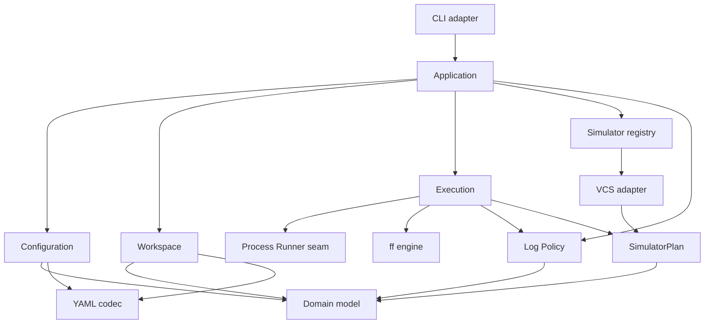
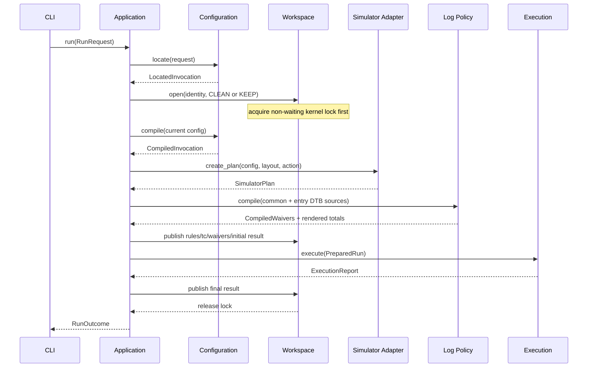
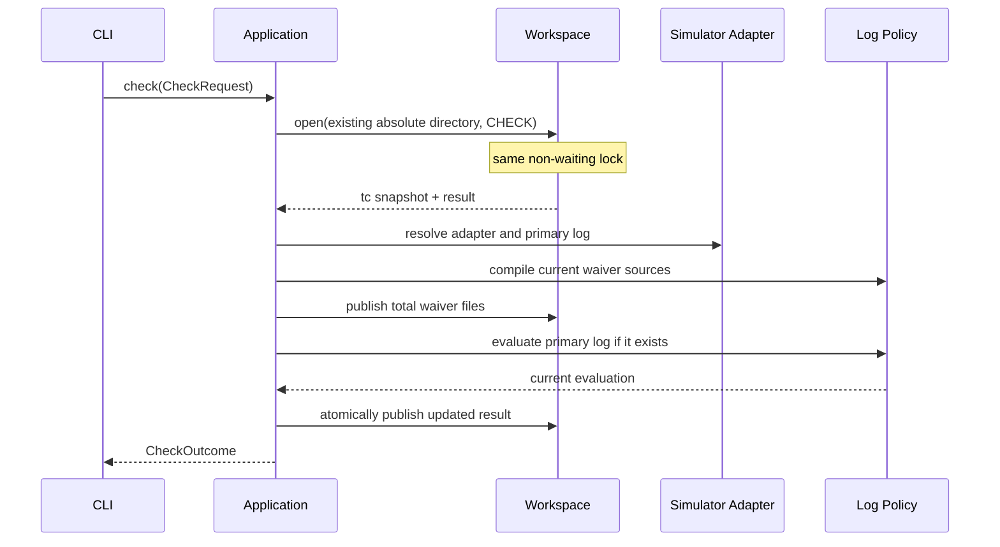

# esim 代码架构设计

状态：已由用户确认（2026-08-09）

需求：[`docs/requirements/esim.md`](../../requirements/esim.md)

计划：[`docs/development/plans/2026-08-08-esim-code-architecture.md`](../plans/2026-08-08-esim-code-architecture.md)

## 1. 结论

建议把 esim 拆成 7 个核心深模块，外加 CLI 和三个共享支撑模块：

| 模块 | 核心职责 | 主要 interface |
|---|---|---|
| Application | 保持全局顺序不变式，编排 run/check | `run(request)`、`check(request)` |
| Configuration | 从 selector 生成已验证 Effective TC | `locate(request)`、`compile(request)` |
| Workspace | 目录布局、内核锁、清理策略、快照和原子结果写入 | `open(identity, mode)` |
| Execution | 把配置、hooks 和 simulator plan 执行成 report | `execute(prepared_run)` |
| Simulator Adapter | 把simulator 差异转成声明式命令、artifact 和 detector | `create_plan(request)` |
| Process Runner | 可控地启动外部进程并写入完整日志 | `run(command)` |
| Log Policy | 编译 waiver，生成总规则文件，识别和放过 findings | `compile(sources)`、`evaluate(log)` |

CLI adapter 只解析参数和呈现结果。`model`、`errors` 和 `yaml_codec` 是共享支撑，不应变成编排逻辑的藏身处。

## 2. 设计目标

### 2.1 小的对外 interface

用户、CLI 和黑盒测试只需理解：

```python
class EsimApplication:
    def run(self, request: RunRequest) -> RunOutcome: ...
    def check(self, request: CheckRequest) -> CheckOutcome: ...
```

`run` 隐藏 selector、include graph、合并、锁、workspace、ff、hooks、simulator、waiver 和 result 的组合顺序。`check` 隐藏锁、快照读取、waiver 重建、主日志重判和 result 原子更新。

### 2.2 把不变式放在拥有它的模块中

- Rules/TC 角色、include 顺序、field merge 和 schema 错误属于 Configuration。
- 锁必须早于清理/读写，原子替换和固定路径属于 Workspace。
- hook/tool 节点顺序、失败截断和 cleanup report 属于 Execution。
- VCS/Xcelium 命令、artifact 和 tool-specific detector 属于 Simulator Adapter。
- glob/regex、built-in/common/local 来源顺序和 finding 去重属于 Log Policy。

### 2.3 只在真正变化的位置建 seam

首版只设两个可替换 seam：

1. `SimulatorAdapter`：VCS 是首个 adapter，Xcelium 是已知的第二个。
2. `ProcessRunner`：生产中使用 subprocess adapter，测试中使用 scripted adapter。

不为文件系统、YAML parser 或 ff engine 建公开抽象工厂：

- 文件系统可以通过 pytest `tmp_path` 使用真实本地实现。
- YAML 首版只有一个 codec，不存在第二个 adapter。
- ff 已有 `flatten_filelist(FlattenRequest) -> FlattenResult` 深 interface，esim 直接使用。

Execution 可在构造时接收私有 flattener callable，以便覆盖罕见失败；这是模块内部 seam，不进入 esim 的公开 interface。

## 3. 建议包布局

```text
src/
├── ff/
│   ├── __init__.py             # 现有 flattening engine interface
│   └── cli.py
└── esim/
    ├── __init__.py             # RunRequest/Outcome 与便捷 run/check
    ├── cli.py                  # argparse + 终端呈现 + 退出码
    ├── application.py          # EsimApplication
    ├── model.py                # 不可变领域值和执行记录
    ├── errors.py               # InputError 等受控错误
    ├── yaml_codec.py           # 具体 safe load / deterministic dump
    ├── configuration/
    │   ├── __init__.py         # 只导出 locate/compile interface
    │   ├── _selectors.py
    │   ├── _graph.py
    │   ├── _schema.py
    │   ├── _merge.py
    │   └── _arguments.py
    ├── workspace/
    │   ├── __init__.py         # 只导出 open interface/layout
    │   ├── _lock.py
    │   └── _store.py
    ├── execution.py            # 通用 flow/hook/tool 执行器
    ├── process.py              # ProcessRunner + subprocess adapter
    ├── log_policy.py           # waiver + finding 判定
    └── simulators/
        ├── __init__.py         # SimulatorAdapter/registry/plan model
        └── vcs.py              # VCS adapter
```

`configuration/` 和 `workspace/` 是包级深模块；下划线文件是 implementation detail，不应被 CLI、Application 或测试直接 import。如果首个纵向切片时内部实现尚小，可先放在 `__init__.py`/单文件中，只在导航困难时按上述私有边界拆分；不为满足目录图预建空文件。

`model.py` 只放稳定、被多个模块共享的值类型。某个类型如果只有一个模块使用，应留在该模块内，避免 `model.py` 变成全局杂物箱。

## 4. 核心领域模型

建议使用 frozen dataclass 和 enum 表达已验证状态，避免在模块之间传递可修改嵌套 `dict`。

### 4.1 输入与身份

```python
class Action(Enum):
    FULL = "full"
    BUILD = "build"
    RUN = "run"

@dataclass(frozen=True)
class RunRequest:
    tc_selector: str
    rules_selector: str | None
    action: Action
    keep: bool
    build_args: tuple[str, ...]
    elaborate_args: tuple[str, ...]
    run_args: tuple[str, ...]

@dataclass(frozen=True)
class SimulationIdentity:
    dtb_key: str
    rules_key: str
    test_key: str
    directory: Path

@dataclass(frozen=True)
class LocatedInvocation:
    entry_tc: Path
    entry_rules: Path
    identity: SimulationIdentity
```

Application 在构造时接收一份环境快照，至少包含 `DV_HOME`、`DV_TMP` 和用于受控展开的变量。不在各模块内反复直接读 `os.environ`，以便同一 invocation 内语义稳定且测试可重现。

### 4.2 配置值

稳定共享类型至少包括：

- `ConfigType.TC/RULES`
- `Simulator.VCS`
- `Flow.TWO_STEP/THREE_STEP`
- `HookSpec(commands, continue_on_error)`
- `PhaseSpec(args, argv, hooks)`
- `BuildSpec`
- `ResolvedRules`
- `EffectiveTc`
- `SourceProvenance`
- `IgnoredField(source, field_path)`
- `CompiledInvocation`

`PhaseSpec.args` 保留合并后要写入快照的原始 fragments，`argv` 保存通过 shlex 和受控环境展开得到的执行 token。两者由 Configuration 一次生成，避免快照和执行阶段各自重新解析。

### 4.3 结果值

- `RunStatus.PASS/FAIL/NOT_RUN`
- `CommandRecord`：节点、argv/用户 hook 标识、退出码、日志路径
- `Finding`：日志、行号、原文、命中原因、waiver 来源
- `ExecutionReport`：实际执行节点和最终状态
- `ResultSnapshot`：可序列化的当前 result
- `RunOutcome`/`CheckOutcome`：Application 的窄 interface 返回值

## 5. 核心模块

### 5.1 Application

`application.py` 是唯一了解端到端运行顺序的模块。它不解析 YAML、不构造 VCS argv、不自己扫描日志。

构造依赖建议：

```python
class EsimApplication:
    def __init__(
        self,
        *,
        environment: Mapping[str, str],
        configuration: ConfigurationCompiler,
        workspaces: WorkspaceManager,
        execution: ExecutionEngine,
        log_policy: LogPolicy,
        simulators: SimulatorRegistry,
        diagnostics: DiagnosticSink,
    ) -> None: ...
```

`DiagnosticSink` 是内部 seam，只需支持已确认的 warning/debug 呈现；生产使用 onelog adapter，测试使用收集器。它不是新的公开日志框架。

Application 拥有以下顺序不变式：

1. 最小 selector 定位出 `LocatedInvocation`。
2. 立即打开 Workspace 并获取锁。
3. 根据 full/keep/action/check 应用目录策略。
4. 读取 Stage action 所需的旧快照。
5. 编译当前配置并完成全部 preflight。
6. 选择 simulator adapter，构建 simulator plan。
7. 编译 waiver，发布快照、总 waiver 和初始 result。
8. 执行或重检。
9. 在内部 cleanup 路径中发布最终 result 并释放锁。

Application 不应暴露 `prepare_ff()`、`run_hook()`、`write_tc_yaml()` 等细粒度公开方法；否则调用者必须重新学习正确顺序，Application 将退化为浅通过层。

### 5.2 Configuration

Configuration 是包级深模块，外部 interface 只保留两个操作：

```python
class ConfigurationCompiler:
    def locate(self, request: RunRequest) -> LocatedInvocation: ...
    def compile(self, request: CompileRequest) -> CompiledInvocation: ...
```

`locate` 隐藏：

- 逻辑/绝对 TC selector 解析。
- Rules `-f` 默认值和四步搜索。
- 专用后缀优先级。
- 路径角色校验。
- dotted keys 和 simulation directory 派生。

`compile` 隐藏：

- safe YAML decode 和源字段类型检查。
- path-based `config_type` 派生。
- include 受控环境展开、路径解析、深度优先后序、cycle/diamond 处理。
- Rules graph→TC graph→CLI 的全局合并。
- `filelist` 恰好一次与 simulator/flow 一致性校验。
- two/three-step shape 和已知字段角色校验。
- unknown field 诊断。
- args shlex/环境展开和 ff define adapter 校验。
- provenance、Resolved Rules、Effective TC 和快照模型。
- Stage action 时与旧快照的上游配置兼容性。

`CompileRequest` 可选带入 Workspace 读出的 cached snapshots 和 action，让 Configuration 根据自己所拥有的字段语义判定 ff/filelist/build 上游是否兼容。Workspace 不理解哪些 YAML 字段属于上游。

Configuration 可以对外提供这个 engine seam 供测试和未来工具使用，但不暴露 `_graph`、`_merge` 等 implementation detail。

### 5.3 Workspace

Workspace 合并了必须共享同一路径不变式的能力：

- `$DV_TMP/<dtb>/<rules>/<test>/` 布局和全部受管路径。
- 目标目录外的非等待内核锁。
- clean/keep/action/check 目录策略。
- cached snapshots/result 读取。
- `rules.yaml`、`tc.yaml`、`result.yaml` 和总 waiver 的原子发布。

建议 interface：

```python
class WorkspaceManager:
    @contextmanager
    def open(
        self,
        identity: SimulationIdentity,
        mode: WorkspaceMode,
    ) -> Iterator[WorkspaceSession]: ...

class WorkspaceSession:
    @property
    def layout(self) -> WorkspaceLayout: ...

    def load_cached_state(self) -> CachedRunState: ...
    def publish_inputs(self, bundle: InputSnapshotBundle) -> None: ...
    def publish_result(self, result: ResultSnapshot) -> None: ...
```

`WorkspaceLayout` 是不可变路径集，包含 flattened filelist、工具/用户 hook logs、simv、snapshots 和总 waiver。Simulator Adapter 只使用这些路径，不自己拼接 `$DV_TMP`。

Workspace 不判定 TC/Rules 字段语义，不扫描日志，也不调度命令。

### 5.4 Simulator Adapter

Simulator Adapter 是第一个真正的扩展 seam。它将 Effective TC 和 WorkspaceLayout 转成声明式计划，不产生副作用：

```python
class SimulatorAdapter(Protocol):
    simulator: Simulator

    def create_plan(self, request: SimulatorPlanRequest) -> SimulatorPlan: ...
```

`SimulatorPlan` 包含：

- 按逻辑 phase 索引的 `ToolStep(argv, log_path, detector)`。
- build artifacts 及 action 前置校验。
- simulator 主日志路径。
- keep 时的 simulator-managed artifacts，如果实现需要精确保留/清理。

VCS adapter 拥有：

- two-step `vcs` build argv。
- three-step `vlogan` analyze 和 `vcs` elaborate argv。
- `simv` run argv。
- `-f/-o/-l` 保留选项冲突检查。
- `simv`、`vlogan.log`、`vcs.log`、`simv.log` 等约定。
- VCS tool-specific finding detector。

Adapter 不应执行 subprocess，不应知道 hook merge/ordering，不应写 result.yaml。这使它可以用纯函数式字面 argv 测试，将来加 Xcelium 时不改 Execution。

`SimulatorRegistry` 是小型固定映射，它不是 plugin framework；首版不需要 entry-point 自动发现。

### 5.5 Process Runner

Process Runner 是真外部进程 seam：

```python
class ProcessRunner(Protocol):
    def run(self, command: CommandSpec) -> ProcessResult: ...
```

`CommandSpec` 至少包含：

- 已完整拆分的 argv；
- 固定 simulation directory cwd；
- 日志路径；
- 覆盖或追加模式（同一 hook 的首条覆盖，之后追加）。

生产 `SubprocessRunner` 保证：

- 不经 shell 执行 ToolStep argv。
- hook command 由 Execution 预先转成 `('/bin/bash', '-o', 'pipefail', '-c', command)` argv，Process Runner 无需再区分 hook/tool。
- stdout/stderr 完整、有序地写入受管 log。
- 返回进程退出码，不把非零退出抛成内部异常。
- 不继承 workspace lock FD。

`ScriptedProcessRunner` 只位于 `tests/support/`，按期望命令序列写假输出并返回指定退出码。这是外部进程的 adapter，不是对自有调度器的 mock。

### 5.6 Log Policy

Log Policy 将 waiver 编译和日志判定收口在同一个模块，因为两者共享 finding 数据、行匹配语义和诊断来源：

```python
class LogPolicy:
    def compile(self, sources: WaiverSources) -> CompiledWaivers: ...
    def evaluate(self, request: LogEvaluationRequest) -> LogEvaluation: ...
```

`compile` 的用户 waiver 源固定为
`$DV_HOME/dtb_common/rules/waive.txt|exclude.txt` 和入口 TC 所属
`$DV_HOME/<dtb>/rules/waive.txt|exclude.txt`；不从 `tb/` 目录读取这两类文件。

`compile` 隐藏：

- built-in→`dtb_common/rules/`→入口 DTB `rules/` 来源顺序。
- 缺失/不可读、空行、`#`/`//` 整行注释。
- glob/regex 编译和所有非法规则汇总。
- 总 `waive.txt`/`exclude.txt` 的确定性渲染文本。

`evaluate` 隐藏：

- 逐行读取日志。
- 大小写不敏感、包含单词内部的 generic `fail`/`error` detector。
- 与 `ToolStep.detector` 的并集。
- 同行 finding 去重与多原因保留。
- glob full-line/regex search waiver 判定。
- 原始日志不变。

CompiledWaivers 同时包含内存 matcher 和要发布的两份总文本，让 run 与 check 使用完全相同的规则。Workspace 只原子写入这两份文本，不重新解析它们。

### 5.7 Execution

Execution 消费已经完成 preflight 的 `PreparedRun`，不再读取源 TC/Rules 或修改配置。

```python
class ExecutionEngine:
    def execute(self, run: PreparedRun) -> ExecutionReport: ...
```

`PreparedRun` 包含 Effective TC、WorkspaceLayout、SimulatorPlan、CompiledWaivers 和 action。Execution 拥有：

- full/build/run action 节点选择。
- `ff → build → run` 公共流程。
- two-step build 与 three-step 外层 build/analyze/elaborate 顺序。
- before/tool/log-check/after 的正常路径。
- hook commands 转 Bash argv、同 hook 日志聚合和 `continue_on_error`。
- Command failure 不可 waive，任意失败截断后续用户节点。
- ff 调用及 `FlattenError` 转成受控执行失败。
- 每个已执行节点的 CommandRecord/LogEvaluation 累积。
- 返回完整 ExecutionReport，不直接序列化 result。

Execution 不构造 VCS/Xcelium 命令，不解析 waiver 文件，不选择 workspace 路径。

## 6. 共享支撑模块

### 6.1 YAML Codec

`yaml_codec.py` 封装最终选定 YAML 库的以下差异：

- safe load，禁止任意对象构造。
- 保留字段值的必要来源信息以生成诊断。
- 严格识别 `continue_on_error` 只允许小写 `true`/`false`。
- 快照和 result 的确定性 UTF-8 + LF 序列化。

它是具体 implementation，不定义 `YamlBackend` Protocol。YAML 库会成为新 runtime 依赖，实施前必须按仓库规范由用户批准选型及离线部署影响。

### 6.2 Error model

```text
InputError
├── SelectorError
├── ConfigurationError
├── WorkspaceBusyError
├── WaiverError
└── CacheCompatibilityError
```

这些错误是执行前可预期失败，CLI 统一映射为 2。受控的执行失败不用异常传播，而是进入 ExecutionReport/ResultSnapshot 并映射为 1。未预期异常由 CLI 最外层记录并映射为 3。

子类只在调用者确实需要不同处理时建立；否则使用一个包含结构化 diagnostics 的 `InputError`，避免只为错误名称创建浅类层次。

### 6.3 CLI adapter

`cli.py` 负责：

- 定义 `esim TC [-f RULES] [-a build|run] [-k] [-b ...] [-e ...] [-r ...]`。
- 定义 `esim check ABS_SIM_DIR`。
- 在 invocation 开始时快照 `os.environ`。
- 配置 onelog 但关闭 summary。
- 调用 EsimApplication，呈现 warning/结果路径和最终状态。
- 把 InputError、RunOutcome/CheckOutcome 和未预期异常映射为 0/1/2/3。

CLI 不直接 import VCS adapter、ff engine、YAML codec 或 Workspace；一个 composition root 函数负责组装默认 Application。该函数可位于 `application.py` 或私有 `_bootstrap.py`，首版不必为 dependency-injection container 建框架。

## 7. 依赖方向



必须遵守：

- 所有箭头离开 CLI，没有任何业务模块反向依赖 CLI。
- Configuration 和 Workspace 不互相依赖；Application 传递 typed snapshots。
- Execution 不依赖具体 VCS adapter，只依赖 SimulatorPlan。
- VCS adapter 不依赖 Process Runner 或 Application。
- `model`/`errors`/`yaml_codec` 不依赖高层编排模块。
- 不建立 `utils.py`、`helpers.py` 或 `common.py`；共享行为必须有明确的领域归属。

## 8. 主要执行流

### 8.1 full/keep 运行



所有 selector/YAML/include/waiver/adapter-reserved-option 错误必须在 `execute` 前完成。

### 8.2 Stage action

```text
locate
→ open existing workspace + lock
→ load cached tc/rules/result
→ compile current configuration with cached snapshots
→ validate action-specific upstream compatibility
→ create simulator plan and validate required artifacts
→ compile/publish current waivers and snapshots
→ execute only build or run
→ publish current result
```

`-a build` 不调用 ff，使用已有 `flattened.f`。`-a run` 不调用 ff/build，使用 adapter 声明的 build artifact。Application 不通过检查某个固定 VCS 文件判定所有 simulator。

### 8.3 `esim check`



check 不构建 ExecutionEngine，不启动 ProcessRunner，也不调用 ff。

## 9. 节点执行模型

Execution 内部使用声明式、不对外暴露的 plan node：

```text
HookNode(before/after, commands, continue_on_error, log)
FlattenNode(request, log)
ToolNode(phase, argv, log, detector)
```

节点层面固定模式是：

```text
before → action → log evaluation → after
```

- before Command failure/log finding 失败：不执行 action/after。
- action Command failure/log finding 失败：不执行 after。
- after 失败：截断之后的节点。
- `continue_on_error` 只影响同一 HookNode 中剩余 command 是否运行，不影响节点最终失败。
- 无 commands 的 hook 不生成 HookNode。

ExecutionReport 保留“计划节点”与“实际执行节点”的区分，ResultSnapshot 只写入实际执行记录，不为被截断节点生成空 log。

## 10. 错误与 cleanup

Application 在 Workspace context 内使用一个小型 run recorder 累积已发生的命令和判定，以便任一受控执行失败都可构造完整 ResultSnapshot。

- Preflight InputError：不进入 Execution，CLI 退出 2。是否写入受限的诊断 result 由后续实施设计决定，需求未强制。
- 执行 Command failure/未放过 finding：生成 FAIL result，CLI 退出 1。
- build action 成功：生成 NOT_RUN result，CLI 退出 0。
- full/run action 成功：生成 PASS result，CLI 退出 0。
- 未预期异常：尽可能发布已知当前状态，由 CLI 记录 traceback 并退出 3；不执行任何用户 after/finalize。

Workspace context manager 无论上述哪条路径都关闭受管文件并释放锁。用户 hook 不承担 cleanup 责任。

## 11. 测试 seam

测试按调用者可观察 seam 组织，不镜像私有文件：

合法端到端输入统一使用 `tests/fixtures/esim-demo-project/`；它包含 `dtb_common/env/`、DTB-local `env/`、两/三步 Rules、嵌套 filelist、TC include 和两层 waiver。测试必须先将它复制到 `tmp_path`，不得直接修改版本库中的 fixture。非法 schema、cycle 等单一错误用更小的独立 fixture 或 `tmp_path` 现场输入表达，不污染正常 demo。

```text
tests/
├── test_esim_cli.py
├── test_esim_cli_errors.py
├── test_esim_configuration_selectors.py
├── test_esim_configuration_includes.py
├── test_esim_configuration_merge.py
├── test_esim_configuration_schema.py
├── test_esim_configuration_arguments.py
├── test_esim_application_run.py
├── test_esim_application_actions.py
├── test_esim_application_check.py
├── test_esim_application_locking.py
├── test_esim_log_policy.py
├── test_esim_vcs_adapter.py
├── test_distribution.py
└── support/
    └── scripted_process_runner.py
```

实际创建时只按当前纵向切片需要添加文件，不预建空测试目录。

### 11.1 Configuration seam

用真实 YAML 和 `tmp_path` 调用 `locate/compile`，断言 CompiledInvocation、diagnostics 和结构化错误。不直接测试 `_graph.py` 的 DFS 函数或 `_merge.py` 的辅助函数。

### 11.2 Application seam

使用真实 Configuration、Workspace、Log Policy 和 ff engine，只用 ScriptedProcessRunner 替代外部 VCS/Bash。通过产物、命令序列、result 和退出结果验证编排，不断言私有方法调用次数。

### 11.3 Adapter seam

VCS adapter 是纯 plan builder，直接对 two/three-step/full/action 的字面 argv、log、artifact 和保留参数错误做精确测试。

### 11.4 CLI 和发布 seam

- 用安装的 `esim` 命令验证 argparse、终端输出和 0/1/2/3。
- 扩展 distribution 测试，同时要求 wheel 保留 `ff = ff.cli:main` 并新增 `esim = esim.cli:main`。
- 同步扩展 coverage source 和 Pyright 检查范围到 `ff` + `esim`。

## 12. 建议实施顺序

实施前必须先与用户确认 TDD public seam，并单独确认 YAML runtime dependency。建议按以下纵向切片逐条红-绿-重构：

1. **Configuration 入口切片**：logical/absolute TC、Rules default/search、最小 two-step YAML，产生 CompiledInvocation。
2. **Configuration 组合切片**：include graph、全局合并、角色/flow 校验、args、provenance 和 unknown fields。
3. **Workspace 切片**：simulation identity、锁、clean/keep、快照/总 waiver/result 原子发布。
4. **VCS two-step 端到端切片**：VCS plan + ScriptedProcessRunner + ff engine + build/run + PASS/FAIL result。
5. **Hooks 与 Log Policy 切片**：before/after、Bash argv、聚合 log、`continue_on_error`、generic/tool findings 和 waiver。
6. **VCS three-step 切片**：外层 build 及 analyze/elaborate 节点顺序与截断。
7. **Stage action 切片**：cached snapshot 兼容性、artifact 验证、build/run 单阶段执行和 NOT_RUN。
8. **Check 切片**：锁、waiver 重建、主日志重判和 result 原子更新。
9. **CLI/发布切片**：`esim` entry point、终端呈现、wheel/wheelhouse 与 User Guide。

每个切片必须同步更新 `docs/development/verification.md`；可观察行如果需要修改，同一逻辑变更内同步更新需求、测试、实现和 User Guide。

## 13. 模块深度审查

### 13.1 通过删除测试的模块

- 删除 Configuration：selector、DFS、merge、schema、args 和 provenance 复杂度会分散到 Application/CLI，因此它有深度。
- 删除 Workspace：锁、路径、清理和原子发布会分散到 run/check/action，因此它有深度。
- 删除 Execution：hook/tool 顺序、失败截断和 report 累积会在 VCS/Xcelium 间重复，因此它有深度。
- 删除 Log Policy：run/check 会各自重写 parser、matcher、renderer 和 finding 规则，因此它有深度。

### 13.2 刻意保持很小的 adapter

- CLI 是浅 adapter，但它的存在用于隔离 argparse/终端/进程退出，合理。
- VCS adapter 如果只有纯 argv 构造，也可以较小；它的价值在真实 simulator seam，不要为增大文件而吸收公共执行逻辑。
- Process Runner 是窄外部 seam，不应变成任务编排器。

### 13.3 应拒绝的拆分

- 不建 `TcLoader`、`RulesLoader`、`IncludeResolver`、`Merger`、`Validator` 五个公开对象；它们会要求 Application 知道所有调用顺序。
- 不为 `pre_ff`、`post_ff`、`pre_build` 等每个 hook 创建类。
- 不为每种 log 创建 checker 类层次；用通用 detector + adapter detector 组合。
- 不让每个 simulator 拥有自己的 full run orchestrator。
- 不让 dataclass 模仿 YAML 的每一层空 mapping；数据模型应表达已验证的语义，而不是 parser 中间状态。

## 14. 取舍与风险

### 14.1 Application 仍然可能过大

Application 应仅保持顺序不变式，把规则委托给深模块。如果它开始出现大量 field-level `if` 或 simulator 分支，说明逻辑泄漏，应返回 Configuration 或 Adapter，而不是继续拆更多 coordinator。

### 14.2 数据模型稳定性

当前 dataclass 名称是架构建议，不是冻结的用户界面。实施时应先用第一个纵向切片验证是否真的减少非法状态，再扩展字段。

### 14.3 YAML dependency

用户已批准使用 `PyYAML>=6.0,<7` 完成 safe YAML load/dump，并将其
收入离线 wheelhouse。动机、替代方案和版本约束见
[ADR-0005](../adr/0005-use-pyyaml-for-esim-configuration.md)。

### 14.4 Snapshot schema 详细度

需求已定义快照的内容，但没有冻结所有 YAML key 的顺序、result 子字段和 diagnostic 结构。它们会成为可观察文件 interface，应在 Workspace 实施切片前用小型设计确认，不在 serializer 中即兴决定。

## 15. 需要用户确认的实施前事项

1. 本文档的 7 个核心模块与依赖方向。
2. TDD 的 public seam：Configuration `locate/compile`、Application `run/check`、CLI 和文件产物。
3. YAML runtime dependency 选型及离线发布影响（已批准，见 ADR-0005）。
4. `rules.yaml`/`tc.yaml`/`result.yaml` 的精确序列化 schema。
